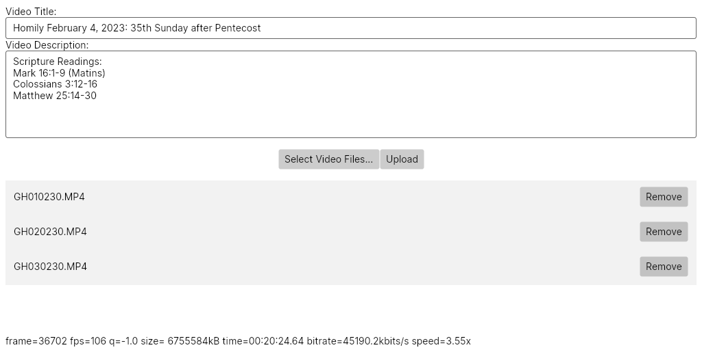

# Splitjoiner



Splitjoiner (Split-Video Joiner... get it? Pretty creative if I do say so myself :laughing:) is a simple app that automates the processes of concatenating split video files.

## Purpose

Splitjoiner is meant to make my life easier.
I manage the YouTube page for my church (check it out [here](https://www.youtube.com/@stelizabethorthodoxpoulsbo)!), and so this is simply meant to eliminate the manual steps of concatenating the video files our GoPro produces.

## Functionality

Splitjoiner allows you to select multiple video files which it will use FFmpeg to combine.
If the video files came from a GoPro and follow the GoPro naming convention (GHXXXXXX.MP4 where the first two numerical digits are the part number), Splitjoiner will automatically add each sequential file to the list.
Due to Google's API restrictions, I've removed the broken uploading code completely (and renamed from Splitloader to Splitjoiner).
This code is still available in the splitloader branch, and maybe one day I'll be able to re-integrate that functionality, but I'm not holding my breath.

## Building

At the moment Linux is the only supported OS.
There's broken Windows support built in, and MacOS support is on the way.
The only hard dependencies of Splitjoiner are .NET 8 and AvaloniaUI.
It's recommended that you have FFmpeg installed on your system, but if you don't for some reason, Splitjoiner will download it automatically.
Once the dependencies are met, you can build and run with the following:

```Bash
git clone https://github.com/calebstein1/Splitjoiner
cd Splitjoiner/Splitloader.UI
dotnet run
```

## Architecture

#### Splitloader.UI

This is the main UI of the app.
It gets the video name, description, and list of video files from the user, then hands that information off to the backend for processing and uploading.
Progress updates are reported back to the interface.

#### Splitloader.VideoTools

This is the interop layer between Splitloader and FFmpeg.
It is used to find an FFmpeg installation on the user's system, or download one that it can use.
Using the list of video files provided by the UI and FFmpeg, it will produce a concatenated video file without re-encoding, which will then be handed to the uploader.
